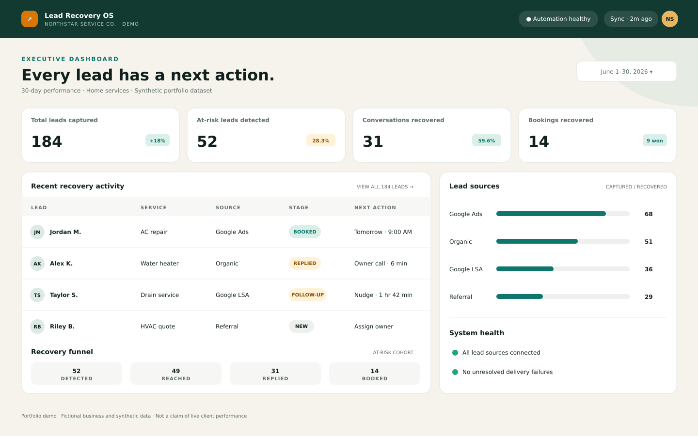
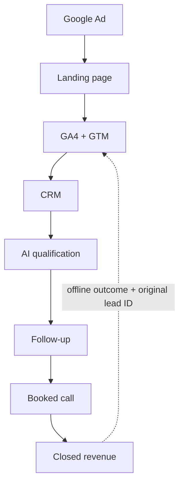

# Ad-to-Revenue Growth System

> A working portfolio case study demonstrating the complete architecture: **Ad → landing page → GA4/GTM → CRM → AI qualification → follow-up → booked call → revenue**.

[](#the-exact-architecture)
[](docs/tracking-plan.md)
[](data/crm-schema.csv)
[](docs/ai-qualification.md)
[](#run-locally)

**Built by [Micheal Aderinto](https://github.com/MICHEALSHOE2000)** · [Portfolio](https://michealaderinto.netlify.app)



## What this demonstrates

Most marketing portfolios stop at the ad or landing page. This repository demonstrates what happens after the form:

- preserve campaign, UTM, and click-ID attribution;
- send clean, consented events through GTM to GA4;
- create one deduplicated CRM record with an owner and response SLA;
- qualify and route the lead using auditable business-fit inputs;
- start fast follow-up with reply, booking, and opt-out stop conditions;
- update CRM and analytics when a call is booked; and
- connect closed-won revenue to the original acquisition source.

The repository includes an **interactive browser demo**, executable qualification and tracking modules, automated tests, a complete CRM field dictionary, GA4/GTM event plan, AI output contract, follow-up playbook, and internally reconciled sample funnel data.

> **Credibility note:** NorthStar Exterior Services is fictional. All names, leads, and performance figures are synthetic demonstration data—not client results. The architecture and code are implementation-ready patterns.

## The exact architecture



| Layer | What happens | Proof in this repository |
| --- | --- | --- |
| Ad | High-intent search campaign passes UTM values and `gclid` | Demo attribution object and sample dataset |
| Landing page | Message-matched offer captures service, urgency, value, location fit, contact details, and consent | [`index.html`](index.html) |
| GA4/GTM | Nine normalized funnel events retain `event_id`, `lead_id`, session, campaign, value, and currency | [`docs/tracking-plan.md`](docs/tracking-plan.md), [`implementation/tracking.js`](implementation/tracking.js) |
| CRM | Idempotent lead record stores attribution, ownership, score, stage, next action, booking, and revenue | [`data/crm-schema.csv`](data/crm-schema.csv) |
| AI qualification | Approved business inputs produce a score, band, route, explanation, and review flag | [`docs/ai-qualification.md`](docs/ai-qualification.md), [`implementation/qualification.js`](implementation/qualification.js) |
| Follow-up | Confirmation, rep alert, timed sequence, quiet hours, and stop conditions reduce missed leads | [`docs/follow-up-playbook.md`](docs/follow-up-playbook.md) |
| Booked call | Verified booking webhook updates the CRM, stops follow-up, and emits `booked_call` | Playbook and interactive demo |
| Revenue | Authorized `Won` status emits final value through `closed_won` using the original lead attribution | Interactive demo and event contract |

## Interactive demonstration

Open the site, submit the pre-filled lead, then select **Simulate booked call** and **Mark opportunity won**. The right-hand console exposes three views:

1. the human-readable journey and AI score;
2. the evolving CRM record; and
3. every GTM-compatible event object in order.

The demo keeps data inside the browser. It does not send contact details to any server or analytics account.

## Event lifecycle

| Order | Event | Trigger | Business meaning |
| ---: | --- | --- | --- |
| 1 | `ad_click` | Paid session begins | Campaign supplied the visit |
| 2 | `landing_page_view` | Matched page loads | Visitor saw the correct offer |
| 3 | `form_start` | First interaction | Visitor showed form intent |
| 4 | `generate_lead` | Valid consented submission | Marketing conversion created |
| 5 | `crm_lead_created` | CRM accepts the record | Sales now owns an auditable lead |
| 6 | `qualification_complete` | Score and route saved | The right queue and SLA are selected |
| 7 | `follow_up_started` | Approved sequence begins | Response system is active |
| 8 | `booked_call` | Verified appointment created | Lead becomes a sales opportunity |
| 9 | `closed_won` | Authorized user records the win | Final revenue is attributed |

Email, phone number, and free-text messages are deliberately excluded from analytics events.

## AI qualification with guardrails

The demo uses a deterministic 100-point fallback so every decision is testable:

| Factor | Maximum | Why it is allowed |
| --- | ---: | --- |
| Service fit | 30 | Matches work the business offers |
| Urgency | 25 | Sets response priority |
| Estimated value | 25 | Supports commercial routing |
| Service-area fit | 15 | Confirms the job is operationally viable |
| Contactability | 5 | Indicates whether follow-up is possible |

- **Hot:** 75–100 → priority sales queue
- **Warm:** 50–74 → standard sales queue
- **Cold:** below 50 → nurture or manual review

An AI model may summarize the request and explain the route, but it receives only approved business-fit fields. Sensitive traits are prohibited. Ambiguous outputs and Cold leads remain reviewable by a person. See the [full AI design](docs/ai-qualification.md).

## Modeled 30-day funnel

| KPI | Synthetic value | Calculation |
| --- | ---: | --- |
| Ad spend | $6,200 | Modeled input |
| Ad clicks | 1,240 | Modeled input |
| Landing-page leads | 92 | 7.42% of clicks |
| Qualified leads | 63 | 68.48% of leads |
| Booked calls | 28 | 44.44% of qualified leads |
| Won jobs | 11 | 39.29% of booked calls |
| Closed revenue | $18,700 | Sum of final won values |
| Revenue / ad spend | 3.02× | $18,700 ÷ $6,200 |

The source of truth is [`data/sample-funnel.json`](data/sample-funnel.json). Figures represent a fictional modeled scenario and must be replaced with verified exports for a real case study.

## Failure handling and controls

- repeated form/webhook events are reconciled by `event_id` and `lead_id`;
- invalid contacts enter a review queue instead of disappearing;
- AI output must match the JSON contract before CRM writeback;
- the deterministic score remains available if the AI step fails;
- automation stops on reply, booking, closed stage, or opt-out;
- quiet hours and consent are configured for the client's channels and jurisdiction;
- revenue uses the final CRM value, never the forecast; and
- PII is kept out of GA4 and diagnostic event logs.

## Run locally

Requirements: Node.js 18 or newer. There are no third-party runtime dependencies.

```bash
npm test
npm start
```

Then open `http://localhost:4173`.

## Repository structure

```text
.
├── index.html                         # Interactive case-study experience
├── styles.css                        # Responsive presentation layer
├── app.js                            # Browser journey and CRM simulation
├── implementation/
│   ├── tracking.js                   # GTM-compatible event builder
│   └── qualification.js              # Auditable score and routing fallback
├── tests/
│   ├── tracking.test.js
│   └── qualification.test.js
├── docs/
│   ├── tracking-plan.md              # GA4/GTM event and QA contract
│   ├── ai-qualification.md           # AI prompt, schema, and safeguards
│   └── follow-up-playbook.md         # SLA, sequence, booking, and close-out
├── data/
│   ├── crm-schema.csv                # CRM field dictionary
│   └── sample-funnel.json            # Reconciled synthetic metrics
├── assets/                           # Existing dashboard/workflow visuals
├── package.json
└── server.mjs
```

## My role

I designed the acquisition journey, landing-page flow, measurement contract, CRM schema, qualification logic, routing, follow-up sequence, booking handoff, revenue attribution, tests, and client-facing presentation.

## Work with me

I help local-service businesses connect advertising, conversion tracking, CRM follow-up, and AI workflow automation so owners can see which marketing activity produces booked work and revenue.

**[View my portfolio](https://michealaderinto.netlify.app)** · **[View my GitHub profile](https://github.com/MICHEALSHOE2000)**
