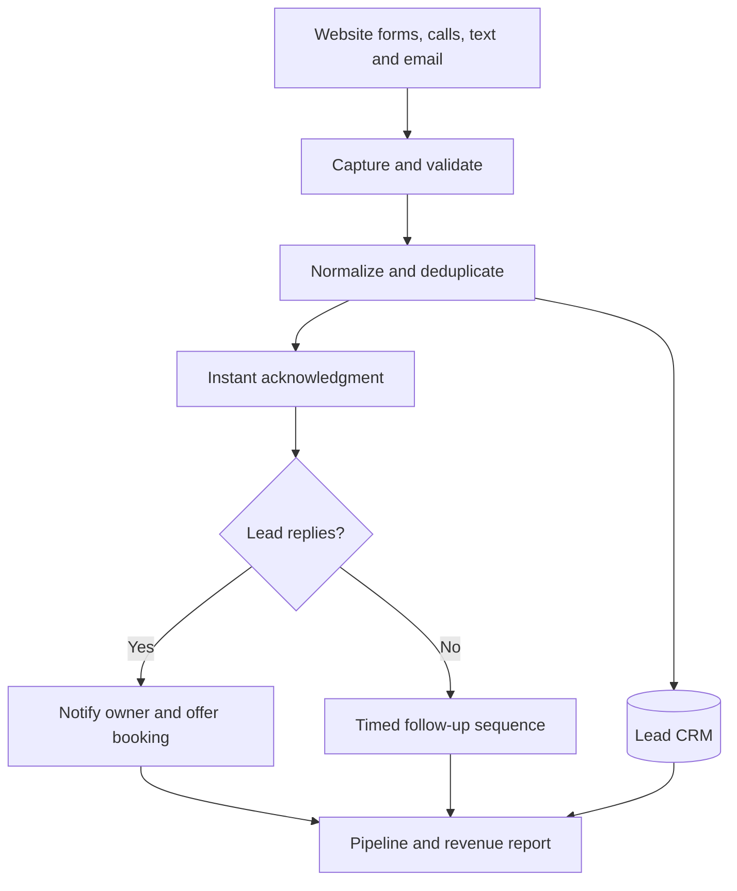
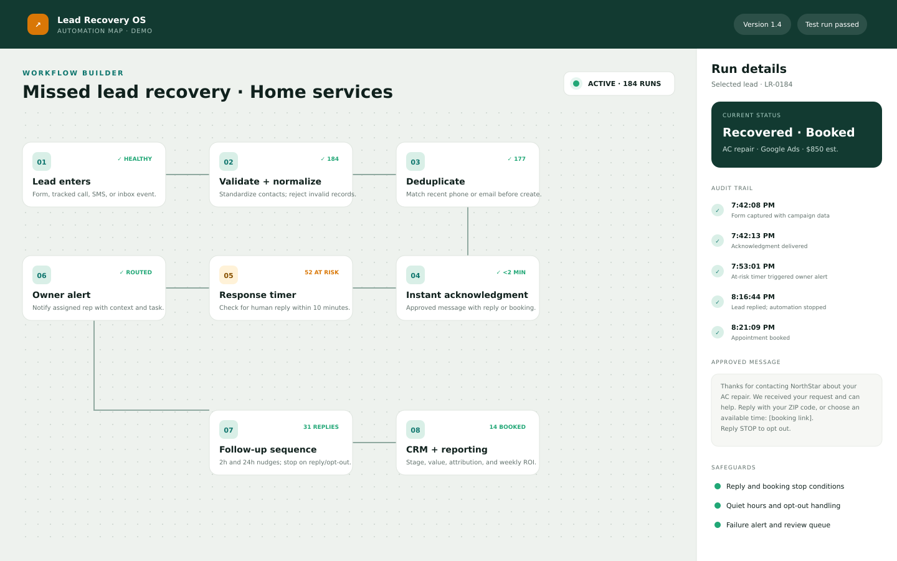
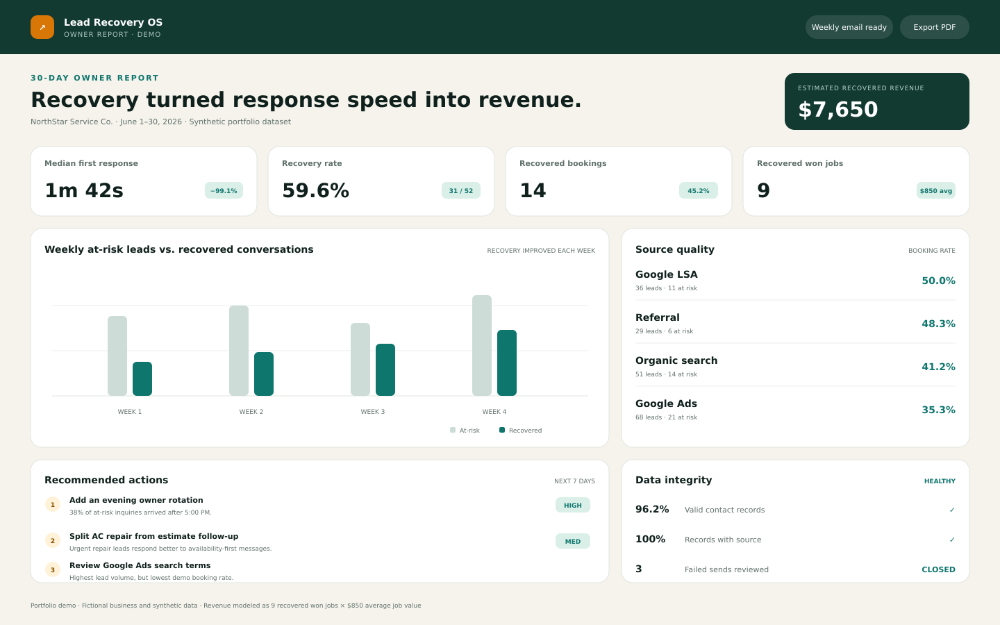

# Missed Lead Recovery System

> A conversion and follow-up system that helps USA local-service businesses respond to every inquiry, recover missed opportunities, and connect marketing activity to booked revenue.

[](#solution-architecture)
[](#ideal-client)
[](#results--measurement)

**Built by [Micheal Aderinto](https://github.com/MICHEALSHOE2000)** · [Portfolio](https://michealaderinto.netlify.app)


## Executive summary

Local-service companies often pay for Google Ads, SEO, referrals, and website traffic but lose leads after the click. Calls go unanswered, forms wait in an inbox, source data disappears, and follow-up depends on someone remembering to do it.

I designed a **Missed Lead Recovery System** that captures inquiries from forms, calls, text, and email; creates one clean CRM record; sends a fast, helpful acknowledgment; alerts the right person; follows up until the lead replies or opts out; and reports which sources produce bookings and revenue.

This case study uses a **synthetic 30-day dataset for a fictional USA home-service company**. The workflow, screens, calculations, and implementation plan are real; the business name and performance figures are illustrative, not claims about a live client.

### Demo result at a glance

In the modeled 30-day scenario, the system identified **52 at-risk leads**, recovered **31 conversations**, produced **14 bookings**, and connected **9 won jobs** to an estimated **$7,650 in recovered revenue**. Median first response fell from **3 hours 18 minutes** to **1 minute 42 seconds**.

## The business problem

A growing home-service company can generate enough leads and still have a revenue leak:

- Calls arrive while technicians are working or after business hours.
- Website forms land in a shared inbox with no owner or deadline.
- Staff copy lead details between tools, creating duplicates and gaps.
- Prospects contact the next provider when the first response is slow.
- Owners can see ad spend, but not which leads became appointments or revenue.

The core problem is not simply “more leads.” It is **speed-to-lead, ownership, consistent follow-up, and attribution**.

### Success criteria

The system is designed to:

1. acknowledge every valid inquiry in under two minutes;
2. give every lead an owner, status, source, and next action;
3. recover inquiries with no human response inside ten minutes;
4. stop automation when a person replies, books, or opts out; and
5. show recovered pipeline and revenue in a weekly report.

## Solution architecture



### Example implementation stack

The design is vendor-flexible. A typical small-business setup can use:

| Layer | Lean implementation | Scalable alternative |
| --- | --- | --- |
| Lead sources | Website form, tracked phone number, SMS, shared email | Multiple landing pages and location numbers |
| Orchestration | Make or n8n | Custom API or managed automation |
| CRM | Airtable or Google Sheets | HubSpot, GoHighLevel, or existing CRM |
| Follow-up | Email + compliant business SMS | Omnichannel sequences with routing |
| Booking | Calendly or CRM calendar | Dispatch/field-service scheduling tool |
| Reporting | Airtable Interface or Looker Studio | CRM and ad-platform BI dashboard |

> Consent, quiet hours, opt-out handling, access controls, and message retention should be configured for the client's jurisdiction and communication channels before launch.

## Recovery workflow



| Timing | System action | Business purpose |
| --- | --- | --- |
| 0–10 seconds | Validate the lead, standardize phone/email, attach UTM and source data, check for duplicates | Create one reliable customer record |
| Under 2 minutes | Send a short acknowledgment with a booking or reply option | Confirm the inquiry was received while intent is high |
| At 10 minutes | If no human response is logged, alert the assigned owner | Prevent silent lead loss |
| At 2 hours | Send a useful, non-pushy follow-up | Restart the conversation without repeating the first message |
| At 24 hours | Send a service-specific answer, proof point, or availability prompt | Reduce uncertainty and make replying easy |
| At 3 days | Close the active sequence politely and keep the record for reporting | Protect the customer experience and staff time |
| Every week | Email an owner summary of leads, response time, recovery, bookings, and source quality | Turn the workflow into a management system |

### Stop conditions and safeguards

Automation stops immediately when the lead replies, books, is marked unqualified, or opts out. Invalid contacts go to a review queue. Failed sends create an alert instead of silently advancing. Every status change receives a timestamp so the report can be audited.

## CRM and reporting design

Each record contains the fields needed for action and attribution:

- lead ID, created time, contact details, and service requested;
- original source, campaign, landing page, and tracked channel;
- assigned owner, stage, last contact, and next action;
- first-response time, automation status, and opt-out status;
- appointment date, estimated value, won/lost status, and closed revenue.



## Results & measurement

### Illustrative 30-day demo outcomes

The following numbers come from the synthetic dataset shown in the mockups. They demonstrate how I would calculate and report value once real client data is connected.

| KPI | Modeled baseline | Demo run | Modeled impact |
| --- | ---: | ---: | ---: |
| Median first response | 3h 18m | 1m 42s | 99.1% faster |
| At-risk leads receiving follow-up | 16 of 52 | 49 of 52 | +206% |
| Recovered conversations | 8 | 31 | +288% |
| Bookings from at-risk leads | 3 | 14 | +367% |
| Won jobs from recovered leads | 3 | 9 | +6 jobs |
| Estimated recovered revenue | $2,550 | $7,650 | +$5,100 |

**Definitions**

- **At-risk lead:** no human response logged within ten minutes of inquiry.
- **Recovered conversation:** an at-risk lead that replies after the recovery workflow starts.
- **Recovered revenue:** closed revenue from a lead first classified as at risk.
- **Estimated revenue:** won jobs × the demo average job value of $850.

For a real deployment, baseline performance would be measured before launch and compared with a defined post-launch window. Revenue would come from closed CRM records—not clicks, opens, or message replies.

### ROI model

```text
Recovered revenue = recovered won jobs × average job value
Net value         = recovered revenue − system and messaging cost
ROI               = net value ÷ system and messaging cost
```

The model separates **pipeline**, **bookings**, and **closed revenue** so the owner can see genuine business value without inflating results.

## Ideal client

This system is a strong fit for USA businesses where one missed inquiry can be worth hundreds or thousands of dollars:

- HVAC, plumbing, roofing, electrical, and restoration companies;
- mobile mechanics, auto repair, detailing, and towing companies;
- dental, med-spa, legal, and other appointment-led local services; and
- multi-location businesses running paid search or local SEO.

The best initial candidate already receives at least 30 monthly inquiries and currently relies on a shared inbox, personal phone, spreadsheet, or inconsistent manual follow-up.

## What the client receives

- lead-flow audit and missed-opportunity baseline;
- source tracking for forms, calls, email, and approved messaging channels;
- CRM pipeline with ownership, stages, and next actions;
- recovery messages adapted to the client's services and voice;
- automation with reply, booking, opt-out, and failure safeguards;
- weekly KPI dashboard and owner summary; and
- handoff documentation plus staff training.

## Validation plan

Before launch, I would test every source with unique dummy data, confirm field mapping and deduplication, verify response and stop conditions, simulate failed sends, confirm time-zone and quiet-hour behavior, check permissions, and reconcile a sample report against raw CRM records.

After launch, I would review delivery failures daily for the first week and report response time, recovery rate, booking rate, source quality, and closed revenue weekly.

## Repository contents

```text
missed-lead-recovery-case-study/
├── README.md
├── assets/
│   ├── dashboard-overview.png
│   ├── automation-workflow.png
│   ├── weekly-report.png
│   ├── dashboard-overview.svg
│   ├── automation-workflow.svg
│   ├── weekly-report.svg
│   └── mockups.html
└── scripts/
    └── render-screenshots.mjs
```

The three PNG images are portfolio-ready mockups. The matching SVG files and `assets/mockups.html` provide editable source layouts, and the render script can regenerate consistent 1440 × 900 screenshots from the HTML version.

### Regenerate the screenshots

```bash
npm install playwright
node scripts/render-screenshots.mjs
```

## My role

For this portfolio project, I handled the business analysis, system design, CRM data model, recovery logic, KPI definitions, reporting structure, and presentation of the client-facing case study.

## Next step

If your business is generating leads but losing track of calls, forms, or follow-up, I can map the current lead journey and identify the first recovery opportunity before recommending tools.

**[View more of my work](https://michealaderinto.netlify.app)** · **[GitHub profile](https://github.com/MICHEALSHOE2000)**
